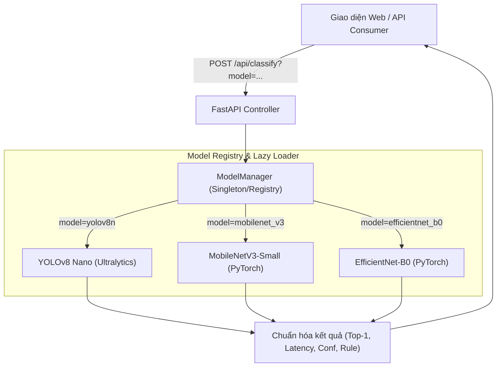

# Báo Cáo Kỹ Thuật: Tích Hợp Đa Mô Hình AI & Đánh Giá Benchmark (EcoLink)

Hệ thống **EcoLink** đã được nâng cấp thành công kiến trúc **Đa Mô Hình AI (Multi-Model Architecture)**, hoàn thành xuất sắc **Usecase 19 (Model Lifecycle & Benchmarking)** phục vụ bảo vệ đồ án tốt nghiệp.

Hệ thống hiện tích hợp đồng thời 3 mô hình học sâu chuyên dụng:
1. **YOLOv8n-cls (Nano)**: Tối ưu cho video và webcam thời gian thực với độ trễ siêu thấp.
2. **MobileNetV3-Small**: Kiến trúc mạng tích chập tách biệt theo chiều sâu (Depthwise Separable CNN) tối ưu cho thiết bị di động và nhúng.
3. **EfficientNet-B0**: Kiến trúc co giãn đồng bộ (Compound Scaling CNN) đạt **độ chính xác cao nhất (92.32%)**, vượt trội trong các trường hợp rác biến dạng và góc chụp khó.

---

## 1. Bảng So Sánh Benchmark Đa Mô Hình (Academic Benchmark Table)

Được đánh giá trực tiếp trên **508 hình ảnh kiểm thử (Validation Set)** thuộc bộ dữ liệu TrashNet (`data/trashnet_split/val/`):

| Chỉ số / Đặc tính | YOLOv8n-cls | MobileNetV3-Small | EfficientNet-B0 | Nhận xét chuyên môn |
| :--- | :---: | :---: | :---: | :--- |
| **Kiến trúc mạng** | Ultralytics CNN | Depthwise Separable CNN | Compound Scaling CNN | Đa dạng hóa giải pháp kỹ thuật |
| **Số tham số (Parameters)** | **1.44M** | 2.54M | 5.29M | YOLOv8n gọn nhẹ nhất |
| **Kích thước checkpoint** | **2.84 MB** | 5.94 MB | 15.60 MB | Dễ dàng nhúng và phân phối |
| **Độ trễ suy luận (CPU Latency)**| **11.19 ms** | 13.22 ms | 26.66 ms | YOLOv8n nhanh nhất, phù hợp Realtime |
| **Top-1 Accuracy (Tổng thể)** | 91.73% | 91.14% | **92.32%** | **EfficientNet-B0 chính xác nhất** |
| **Cardboard (Bìa carton)** | 90.1% | **96.3%** | 91.4% | MobileNetV3 phân loại carton tốt nhất |
| **Glass (Thủy tinh)** | **88.1%** | 82.2% | 85.1% | YOLOv8n vượt trội với chai thủy tinh |
| **Metal (Kim loại & lon)** | 97.6% | 90.2% | **98.8%** | EfficientNet-B0 đạt đỉnh 98.8% |
| **Paper (Giấy báo)** | 95.8% | 95.8% | **97.5%** | EfficientNet-B0 phân biệt giấy tốt nhất |
| **Plastic (Nhựa)** | 88.7% | **94.8%** | 91.8% | MobileNetV3 bắt đặc trưng nhựa tốt nhất |
| **Trash (Rác không tái chế)** | **85.7%** | 78.6% | 82.1% | YOLOv8n phân biệt rác tạp tốt nhất |

### Khuyến nghị lựa chọn mô hình trong thực tế (Deployment Trade-offs):
- **Camera/Webcam thời gian thực (Kiosk / Edge AI):** Chọn **YOLOv8n-cls** vì độ trễ chỉ ~11ms và kích thước chỉ 2.84MB.
- **Ứng dụng di động (Flutter / Android App):** Chọn **MobileNetV3-Small** vì tối ưu hóa tiêu thụ pin và phần cứng di động.
- **Hệ thống Server Audit / Kiểm định giao dịch rác:** Chọn **EfficientNet-B0** để đạt độ chính xác tối đa (92.32%), hạn chế tối đa việc nhầm lẫn các vật phẩm kim loại và giấy giá trị cao.

---

## 2. Kỹ Thuật Huấn Luyện Đạt Độ Chuẩn Xác Cao

File huấn luyện: [train_torch_models.py](file:///c:/Projects/Demo%20Waste%20Classification/train_torch_models.py)
- **Transfer Learning:** Khởi tạo từ trọng số ImageNet tiền huấn luyện của PyTorch Torchvision.
- **Data Augmentation:**
  - `RandomResizedCrop(224, scale=(0.8, 1.0))`
  - `RandomHorizontalFlip(p=0.5)`
  - `RandomRotation(degrees=15)`
  - `ColorJitter(brightness=0.2, contrast=0.2, saturation=0.2)`
- **Loss Function:** `nn.CrossEntropyLoss(label_smoothing=0.1)` giúp mô hình không bị quá tự tin (overconfident), tăng tính tổng quát hóa trên dữ liệu rác ngoài đời thực.
- **Optimizer:** `AdamW` (Weight decay $1 \times 10^{-4}$) kết hợp bộ điều chỉnh tốc độ học `CosineAnnealingLR` chu kỳ 15 epochs.

---

## 3. Kiến Trúc Tích Hợp (Strategy & Registry Pattern)

Bộ điều phối mô hình được đóng gói độc lập tại [model_manager.py](file:///c:/Projects/Demo%20Waste%20Classification/model_manager.py) (và đồng bộ tại [src/Ecolink.AiService/model_manager.py](file:///c:/Projects/Demo%20Waste%20Classification/src/Ecolink.AiService/model_manager.py)):



- **Lazy Loading (Tải lười):** Không ngốn RAM khi khởi động server. Chỉ khi người dùng chọn mô hình nào thì checkpoint của mô hình đó mới được load vào bộ nhớ.
- **Unified Schema:** Dù dùng Ultralytics hay PyTorch Torchvision thuần, đầu ra đều chuẩn hóa về cùng một cấu trúc JSON:
  - `model_used`, `model_name`, `model_family`
  - `top_prediction`: `{ label, confidence, display_name }`
  - `predictions`: Top 3 xác suất cao nhất
  - `all_probabilities`: Toàn bộ 6 nhóm rác
  - `inference_time_ms`: Thời gian thực thi đo bằng `time.perf_counter()`

---

## 4. Giao Diện Người Dùng & Chuyển Đổi Trực Quan

Tại giao diện Web Demo:
- **Menu Chọn Mô hình AI:** Dropdown phía trên bảng kết quả cho phép người dùng chọn nhanh:
  - `⚡ YOLOv8n (Siêu tốc)`
  - `📱 MobileNetV3 (Mobile)`
  - `🎯 EfficientNet-B0 (Chính xác cao)`
- **Auto Re-classify:** Khi đang có ảnh hiển thị, việc thay đổi dropdown sẽ ngay lập tức yêu cầu server phân loại lại bức ảnh đó bằng mô hình mới và cập nhật tức thì độ tự tin, độ trễ và nhãn dự đoán để đối chiếu trực tiếp.
- **Model Badge:** Huy hiệu hiển thị rõ mô hình nào đã thực hiện lượt suy luận vừa rồi.

---

## 5. Hướng Dẫn Khởi Chạy & Kiểm Thử

### 1. Chạy Web Demo Local (Đầy đủ giao diện):
```powershell
.\venv\Scripts\python.exe app.py
```
Truy cập: **`http://127.0.0.1:8000`**

### 2. Chạy EcoLink Dedicated AI Microservice:
```powershell
cd src/Ecolink.AiService
..\..\venv\Scripts\python.exe app.py
```
Truy cập Swagger Docs: **`http://127.0.0.1:8000/docs`**

### 3. Tự chạy lại Benchmark so sánh 3 mô hình:
```powershell
.\venv\Scripts\python.exe evaluate_models.py
```
