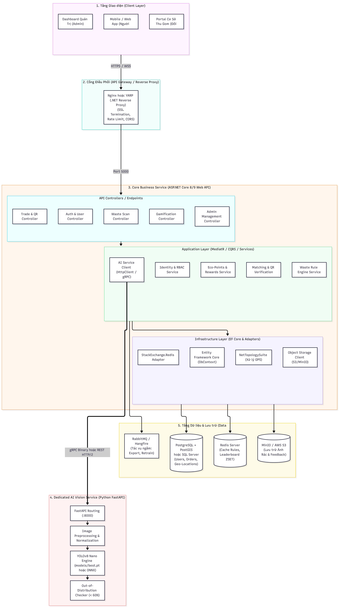
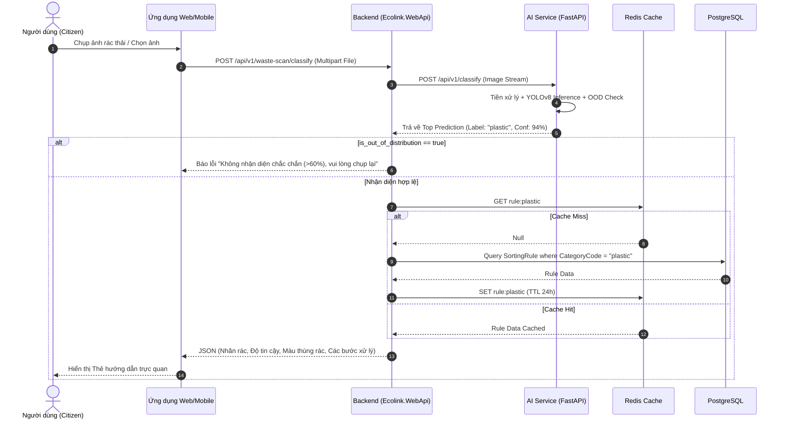
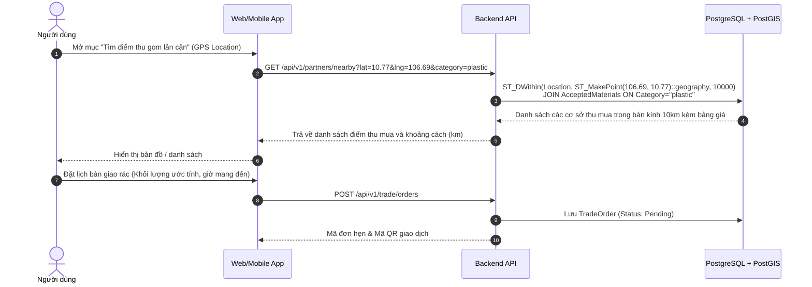
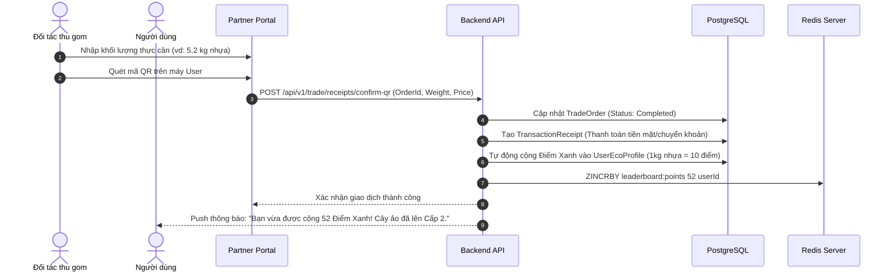
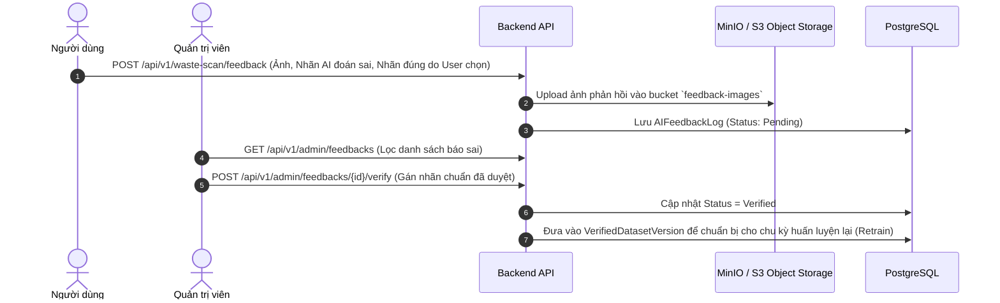

# TÀI LIỆU THIẾT KẾ KIẾN TRÚC HỆ THỐNG ECOLINK
## Intelligent Recyclable Waste Classification and Trade Matching System
*(Hệ thống Hỗ trợ Phân loại và Kết nối Thu mua Rác thải Tái chế Thông minh)*

---

## 1. TỔNG QUAN HỆ THỐNG (SYSTEM OVERVIEW)

### 1.1. Mục tiêu và Bối cảnh
**EcoLink** là nền tảng số toàn diện hỗ trợ người dân phân loại rác thải tái chế bằng thị giác máy tính (AI Computer Vision), đồng thời kết nối trực tiếp người thu gom/cơ sở tái chế với người có nhu cầu bàn giao rác, tích hợp cơ chế tích lũy điểm thưởng xanh (Gamification).

Hệ thống giải quyết 3 bài toán cốt lõi:
1. **Phân loại rác chính xác**: Sử dụng mô hình học sâu (YOLOv8 Nano) kết hợp cơ sở tri thức quy tắc phân loại tĩnh (Rule Engine) và cơ chế lọc dữ liệu ngoài phân phối (Out-of-Distribution - OOD) để đưa ra hướng dẫn chuẩn xác, không sinh nội dung giả mạo (Hallucination).
2. **Kinh tế tuần hoàn (Circular Economy)**: Kết nối cung - cầu rác tái chế bằng thuật toán định vị không gian (Geo-spatial Matching qua PostGIS), tối ưu quãng đường thu gom và minh bạch hóa giao dịch bằng biên nhận mã QR.
3. **Thúc đẩy hành vi xanh**: Gamification (Cây ảo, Huy hiệu, Điểm xanh, Voucher ưu đãi) kích thích người dân duy trì thói quen phân loại lâu dài.

---

## 2. KIẾN TRÚC TỔNG THỂ HỆ THỐNG (HIGH-LEVEL ARCHITECTURE)

Hệ thống được thiết kế theo mô hình **Microservices định hướng dịch vụ (Service-Oriented Architecture)** kết hợp nguyên lý **Clean Architecture (Onion/Hexagonal)** cho khối nghiệp vụ trung tâm.



### 2.1. Phân Tích 5 Tầng Kiến Trúc Chính

| Tầng (Layer) | Thành Phần & Công Nghệ | Vai Trò & Trách Nhiệm |
| :--- | :--- | :--- |
| **1. Client Layer (Giao diện người dùng)** | • **Web / Mobile App (User)**: Flutter / React Native hoặc SPA Web (React/Vite).<br>• **Portal Đối tác (Partner)**: Quản lý danh mục thu mua, tiếp nhận đơn, quét mã QR.<br>• **Dashboard Quản trị (Admin)**: Quản lý quy tắc, kiểm duyệt đối tác, giám sát vòng đời model AI. | • Tiếp nhận tương tác, chụp ảnh/upload ảnh rác, định vị GPS.<br>• Quét/hiển thị QR xác nhận biên nhận bàn giao.<br>• Hiển thị biểu đồ Eco-Tracker, Cây ảo và đổi quà. |
| **2. Cổng Điều Phối (API Gateway / Ingress)** | • **YARP (.NET Reverse Proxy) hoặc Nginx**<br>• Cổng tiếp nhận: Port 5000 / 443 | • SSL/TLS Termination, CORS Handling.<br>• Rate Limiting bảo vệ hệ thống trước tấn công spam ảnh AI.<br>• Định tuyến tải giữa Backend API và các dịch vụ phụ trợ. |
| **3. Core Business Service (Backend Nghiệp Vụ)** | • **ASP.NET Core 8/9 Web API**<br>• Mô hình **Clean Architecture (CQRS / MediatR)**<br>• Cổng giao tiếp: Port 5000 | • Xử lý toàn bộ logic nghiệp vụ, quản lý người dùng, giao dịch thu mua, tích điểm.<br>• Điều phối giao tiếp sang AI Service qua REST/gRPC.<br>• Tích hợp Rule Engine để mapping kết quả nhãn rác sang hướng dẫn thực tế. |
| **4. Dedicated AI Vision Service (Dịch Vụ AI)** | • **Python FastAPI + Ultralytics YOLOv8**<br>• Inference Engine: PyTorch / ONNX Runtime<br>• Cổng giao tiếp: Port 8000 | • Nhận file ảnh từ Backend, tiền xử lý và chuẩn hóa kích thước.<br>• Thực thi suy luận (Inference) phân loại 6-12 nhóm rác thải.<br>• Out-of-Distribution (OOD) Checker: lọc ảnh có độ tự tin < 60% hoặc rác không xác định. |
| **5. Data & Storage Layer (Lưu Trữ Dữ Liệu)** | • **PostgreSQL + PostGIS**: CSDL quan hệ chính.<br>• **Redis Server**: Cache quy tắc, Leaderboard ZSET.<br>• **MinIO / AWS S3**: Object storage lưu ảnh rác & feedback.<br>• **RabbitMQ / Hangfire**: Xử lý tác vụ ngầm (Background jobs). | • Lưu trữ thông tin người dùng, đơn hàng, dữ liệu không gian GPS.<br>• Tối ưu tốc độ tra cứu quy tắc (< 5ms) qua In-Memory Cache.<br>• Quản lý tập dữ liệu kiểm chứng phục vụ Retrain mô hình AI. |

---

## 3. THIẾT KẾ CHI TIẾT CORE BUSINESS SERVICE (ASP.NET CORE CLEAN ARCHITECTURE)

Khối Backend được tổ chức nghiêm ngặt theo 4 tầng của Clean Architecture nhằm đảm bảo tính độc lập với cơ sở dữ liệu, UI và các dịch vụ bên ngoài:

```
src/Ecolink.Backend/
├── Ecolink.Domain/               # Core Enterprise Logic (Entities, Value Objects, Enums)
├── Ecolink.Application/          # Use Cases, CQRS, Interfaces, DTOs, Business Rules
├── Ecolink.Infrastructure/       # EF Core, PostGIS, Redis Adapter, S3/MinIO, External Clients
└── Ecolink.WebApi/               # Controllers, Swagger, Middlewares, Dependency Injection
```

### 3.1. Tầng Domain (`Ecolink.Domain`)
Không phụ thuộc vào bất kỳ thư viện hay framework bên ngoài nào (kể cả EF Core). Chứa các thực thể và quy tắc bất biến của hệ thống:

1. **User & Identity**:
   - `User`: Id, Username, Email, PasswordHash, FullName, PhoneNumber, Role (`Citizen`, `Collector`, `Admin`), Status.
   - `UserEcoProfile`: UserId, CurrentGreenPoints, TotalLifetimePoints, TreeLevel, TreeExperience, BadgesEarned.
2. **Waste & Classification Rules**:
   - `WasteCategory`: Id, Code (`plastic`, `paper`, `glass`, `metal`, `organic`, `cardboard`, `hazardous`), Name, Description, StandardBinColor, IconUrl.
   - `SortingRule`: Id, WasteCategoryId, PreparationSteps, HandlingAction, HazardWarning, ApplicableRegion.
   - `AIFeedbackLog`: Id, ImageUrl, PredictedLabel, ConfidenceScore, UserReportedLabel, AdminVerifiedLabel, Status (`Pending`, `Approved`, `Rejected`), CreatedAt.
3. **Collector & Partner**:
   - `CollectionPartner`: Id, UserId, FacilityName, Address, Location (`Point` - kinh độ/vĩ độ PostGIS), OperatingHours, ContactPhone, IsVerified.
   - `AcceptedMaterial`: Id, PartnerId, WasteCategoryId, PricePerKg, MinimumQuantityKg.
4. **Trading & Transaction**:
   - `TradeOrder`: Id, UserId, PartnerId, Status (`Pending`, `Accepted`, `Rejected`, `Completed`, `Cancelled`), ScheduledAt, EstimatedWeightKg.
   - `TransactionReceipt`: Id, TradeOrderId, ActualWeightKg, UnitPrice, TotalAmountCash, PointsAwarded, QrSecurityCode, CompletedAt.
5. **Gamification & Rewards**:
   - `EcoVoucher`: Id, Title, Description, PointsRequired, DiscountAmount, PartnerSponsor, ExpirationDate, QuantityAvailable.
   - `UserVoucherClaim`: Id, UserId, VoucherId, ClaimedAt, VoucherCode, IsRedeemed.

### 3.2. Tầng Application (`Ecolink.Application`)
Định nghĩa giao diện (Interfaces), DTOs, và các kịch bản sử dụng (Use Cases) đáp ứng 24 Usecases:

- **AI Service Client Interface**:
  ```csharp
  public interface IAiVisionClient
  {
      Task<AiScanResultDto> ClassifyWasteImageAsync(Stream imageStream, string fileName, CancellationToken ct = default);
  }
  ```
- **Waste Rule Engine Service**:
  ```csharp
  public interface IWasteRuleEngineService
  {
      Task<WasteSortingGuideDto> GetSortingGuideAsync(string categoryCode, CancellationToken ct = default);
  }
  ```
- **Geo-Spatial Matching Service**:
  ```csharp
  public interface IGeoMatchingService
  {
      Task<IEnumerable<CollectionPartnerDto>> FindNearestPartnersAsync(double latitude, double longitude, string? wasteCategoryCode, double radiusKm = 10.0, CancellationToken ct = default);
  }
  ```
- **Trade & QR Transaction Service**:
  ```csharp
  public interface ITradeTransactionService
  {
      Task<TradeOrderDto> CreateTradeOrderAsync(CreateTradeOrderCommand cmd, CancellationToken ct = default);
      Task<TransactionReceiptDto> ConfirmReceiptByQrAsync(ConfirmQrReceiptCommand cmd, CancellationToken ct = default);
  }
  ```
- **Gamification & Rewards Service**:
  ```csharp
  public interface IGamificationService
  {
      Task<EcoProfileDto> AwardGreenPointsAsync(Guid userId, decimal weightKg, CancellationToken ct = default);
      Task<ClaimVoucherResultDto> RedeemVoucherAsync(Guid userId, Guid voucherId, CancellationToken ct = default);
      Task<IEnumerable<LeaderboardEntryDto>> GetTopContributorsAsync(int top = 20, CancellationToken ct = default);
  }
  ```

### 3.3. Tầng Infrastructure (`Ecolink.Infrastructure`)
Triển khai kỹ thuật thực tế cho các Interfaces của Application:
- **EF Core DbContext**: Cấu hình các Entity Mapping với PostgreSQL. Sử dụng plugin `Npgsql.EntityFrameworkCore.PostgreSQL.NetTopologySuite` để quản lý kiểu dữ liệu không gian `Point` cho vị trí địa lý của đối tác.
- **AiVisionClient**: HttpClient gửi multipart form-data (kèm ảnh) sang `http://ai-service:8000/api/v1/classify`, có cấu hình Timeout, Polly Retry và Circuit Breaker.
- **RedisCacheService**: Triển khai `IDistributedCache` để lưu trữ quy tắc phân loại rác tĩnh (TTL: 24h) và bảng xếp hạng Leaderboard (Sorted Set).
- **ObjectStorageService**: Tích hợp MinIO / S3 SDK để lưu ảnh chụp rác và ảnh feedback.

### 3.4. Tầng WebApi (`Ecolink.WebApi`)
Cung cấp RESTful endpoints chuẩn OpenAPI / Swagger:
- `POST /api/v1/waste-scan/classify`: Tiếp nhận ảnh, gọi AI Vision, mapping Rule Engine và trả về Top-3 dự đoán kèm hướng dẫn xử lý rác.
- `POST /api/v1/waste-scan/feedback`: Tiếp nhận phản hồi từ người dùng khi AI nhận diện sai.
- `GET  /api/v1/partners/nearby`: Tìm điểm thu mua lân cận theo tọa độ GPS `(lat, lng)`.
- `POST /api/v1/trade/orders`: Tạo yêu cầu bàn giao rác đến cơ sở thu mua.
- `POST /api/v1/trade/receipts/confirm-qr`: Quét mã QR xác thực biên nhận, chốt giao dịch và tự động kích hoạt cộng điểm thưởng.
- `GET  /api/v1/gamification/profile`: Lấy thông tin cấp độ cây ảo, lịch sử điểm xanh.
- `POST /api/v1/gamification/redeem-voucher`: Đổi điểm xanh lấy voucher.
- `GET  /api/v1/gamification/leaderboard`: Xem bảng xếp hạng tuần/tháng từ Redis ZSET.
- `GET/PUT /api/v1/admin/rules`: Quản lý quy tắc phân loại tĩnh.
- `GET/POST /api/v1/admin/ai-datasets`: Quản lý dữ liệu kiểm chứng và chuẩn bị retrain.

---

## 4. DEDICATED AI VISION SERVICE (PYTHON FASTAPI & YOLOV8)

### 4.1. Kiến Trúc Dịch Vụ AI
Dịch vụ được xây dựng độc lập bằng **FastAPI** và **Ultralytics YOLOv8**, chạy trên container riêng biệt.

```
src/Ecolink.AiService/
├── app.py                     # FastAPI Application, Routing & Middleware
├── models/
│   └── best.pt                # YOLOv8n Classification weights (>91% accuracy)
├── services/
│   ├── inference_engine.py    # YOLOv8 Inference, Preprocessing & Tensor Normalization
│   └── ood_detector.py        # Out-of-Distribution Checker (< 60% confidence filter)
├── schemas/                   # Pydantic Request / Response Models
├── requirements.txt           # Thư viện: fastapi, uvicorn, ultralytics, pillow, numpy
└── Dockerfile                 # Đóng gói Python 3.11-slim
```

### 4.2. Cơ Chế Out-of-Distribution (OOD) Checker
Để đảm bảo tính an toàn học máy (Safe AI) theo yêu cầu hệ thống:
1. **Kiểm tra định dạng và chất lượng ảnh**: Ảnh đầu vào được resize về kích thước chuẩn 224x224, kiểm tra độ mờ (Blur detection qua biến thiên Laplacian).
2. **Ngưỡng tự tin động (Confidence Thresholding)**:
   - Nếu $\text{Confidence}(\text{Top-1}) < 0.60$ (60%): Hệ thống đánh dấu cờ `is_out_of_distribution = true`, không gán nhãn rác mò, mà yêu cầu người dùng chụp lại ở góc sáng hoặc cự ly gần hơn.
3. **Xác suất phân phối Entropy**: Tính toán Shannon Entropy trên Softmax distribution. Nếu phân phối phẳng (Entropy cao), vật thể không thuộc 6 nhóm nhãn rác đã huấn luyện (chẳng hạn bàn tay, khuôn mặt, động vật) $\rightarrow$ Từ chối phân loại.

### 4.3. Cấu Trúc Dữ Liệu API AI Response
```json
{
  "success": true,
  "is_out_of_distribution": false,
  "confidence_threshold": 0.60,
  "top_prediction": {
    "label": "plastic",
    "confidence": 0.942,
    "display_name": "Nhựa tái chế (Plastic)"
  },
  "predictions": [
    { "label": "plastic", "confidence": 0.942 },
    { "label": "glass", "confidence": 0.038 },
    { "label": "metal", "confidence": 0.012 }
  ],
  "inference_time_ms": 32.5
}
```

---

## 5. CÁC LUỒNG DỮ LIỆU CỐT LÕI (SEQUENCE & DATA FLOWS)

### 5.1. Luồng 1: Nhận Diện Rác & Ánh Xạ Quy Tắc Xử Lý (UC1, UC2, UC3)


### 5.2. Luồng 2: Tìm Điểm Thu Mua Gần Nhất & Bàn Giao Rác (UC5, UC6, UC7)


### 5.3. Luồng 3: Xác Nhận Biên Nhận Qua Mã QR & Tích Điểm Xanh (UC9, UC10, UC12)


### 5.4. Luồng 4: Phản Hồi Báo Sai & Tinh Chỉnh Mô Hình AI (UC4, UC17, UC18, UC19)


---

## 6. THIẾT KẾ CƠ SỞ DỮ LIỆU QUAN HỆ (DATABASE SCHEMA & SPATIAL MODEL)

Hệ thống sử dụng **PostgreSQL 16** kết hợp tiện ích mở rộng **PostGIS** để tối ưu hóa truy vấn không gian.

```
+-----------------------------------------------------------------------------------+
|                                 DATABASE RELATIONS                                |
+-----------------------------------------------------------------------------------+

   +-------------------------+             +-------------------------------+
   |          Users          |             |       CollectionPartners      |
   +-------------------------+             +-------------------------------+
   | PK  Id (UUID)           |1           1| PK  Id (UUID)                 |
   |     Email (VARCHAR)     |-------------| FK  UserId (UUID)             |
   |     FullName (VARCHAR)  |             |     FacilityName (VARCHAR)    |
   |     Role (VARCHAR)      |             |     Location (GEOMETRY Point) |<--- PostGIS Spatial Index
   |     CreatedAt           |             |     IsVerified (BOOLEAN)      |
   +-------------------------+             +-------------------------------+
          1|                                               1|
           |                                                |
          1|                                               *|
   +-------------------------+             +-------------------------------+
   |     UserEcoProfiles     |             |       AcceptedMaterials       |
   +-------------------------+             +-------------------------------+
   | PK  UserId (UUID)       |             | PK  Id (UUID)                 |
   |     CurrentGreenPoints  |             | FK  PartnerId (UUID)          |
   |     TreeLevel (INT)     |             | FK  WasteCategoryId (UUID)    |
   |     TreeExp (INT)       |             |     PricePerKg (DECIMAL)      |
   +-------------------------+             +-------------------------------+
          1|                                                |
           |*                                               |
   +-------------------------+                              |
   |       TradeOrders       |*                            *|
   +-------------------------+------------------------------+
   | PK  Id (UUID)           |
   | FK  UserId (UUID)       |
   | FK  PartnerId (UUID)    |
   |     Status (VARCHAR)    |
   |     ScheduledAt         |
   +-------------------------+
          1|
           |1
   +-------------------------+             +-------------------------------+
   |   TransactionReceipts   |             |        WasteCategories        |
   +-------------------------+             +-------------------------------+
   | PK  Id (UUID)           |             | PK  Id (UUID)                 |
   | FK  TradeOrderId (UUID) |             |     Code (VARCHAR UNIQUE)     | (plastic, paper, glass...)
   |     ActualWeightKg      |             |     Name (VARCHAR)            |
   |     TotalAmount         |             |     StandardBinColor (VARCHAR)|
   |     PointsAwarded       |             +-------------------------------+
   |     QrSecurityCode      |                            1|
   +-------------------------+                             |
                                                           |1
                                           +-------------------------------+
                                           |         SortingRules          |
                                           +-------------------------------+
                                           | PK  Id (UUID)                 |
                                           | FK  WasteCategoryId (UUID)    |
                                           |     PreparationSteps (TEXT)   |
                                           |     HandlingAction (TEXT)     |
                                           |     HazardWarning (TEXT)      |
                                           +-------------------------------+
```

### Chỉ mục Không Gian (Spatial Indexing)
Đối với bảng `CollectionPartners`, cột `Location` sử dụng kiểu dữ liệu `geography(Point, 4326)`:
```sql
CREATE INDEX idx_collection_partners_location 
ON "CollectionPartners" USING GIST ("Location");
```
Cho phép tìm kiếm các cơ sở thu mua trong bán kính $R$ mét với độ phức tạp $O(\log N)$ cực nhanh.

---

## 7. CẤU TRÚC THƯ MỤC DỰ ÁN TOÀN DIỆN (PROJECT REPOSITORY LAYOUT)

```
c:\Projects\intelligent-waste-sorting-trading\
├── .github/                        # CI/CD Workflows (Build, Test, Container Scan)
├── documents/                      # Tài liệu kỹ thuật, khảo sát & kiến trúc
│   ├── architecture.md             # Bản đặc tả kỹ thuật kiến trúc này
│   ├── architecture.png            # Sơ đồ phân tầng kiến trúc
│   ├── Báo cáo Khảo sát AI...      # Danh mục 24 usecases & nghiên cứu CV
│   └── Báo cáo Đề xuất...          # Chiến lược offline demo
│
├── src/
│   ├── Ecolink.Backend/            # ASP.NET Core Solution (Clean Architecture)
│   │   ├── Ecolink.sln             # Solution file
│   │   ├── Ecolink.Domain/         # Entities, Enums, Value Objects, Domain Exceptions
│   │   │   ├── Entities/           # User, Partner, WasteCategory, TradeOrder...
│   │   │   ├── Enums/              # WasteType, OrderStatus, UserRole...
│   │   │   └── Common/             # BaseEntity, IAggregateRoot
│   │   ├── Ecolink.Application/    # Business Logic, CQRS / Handlers, Interfaces
│   │   │   ├── Interfaces/         # IAiVisionClient, IWasteRuleEngine, IGeoMatching...
│   │   │   ├── Dtos/               # WasteScanResultDto, TradeOrderDto...
│   │   │   └── Services/           # WasteRuleEngineService, GamificationService...
│   │   ├── Ecolink.Infrastructure/ # Data Access & External Adapters
│   │   │   ├── Persistence/        # ApplicationDbContext, Configurations, Migrations
│   │   │   ├── Services/           # AiVisionHttpClient, RedisCacheService, NetTopology...
│   │   │   └── DependencyInjection.cs
│   │   └── Ecolink.WebApi/         # Presentation Layer
│   │       ├── Controllers/        # WasteScanController, TradeController, Gamification...
│   │       ├── Middlewares/        # ExceptionHandlingMiddleware, JwtMiddleware
│   │       ├── appsettings.json
│   │       ├── Program.cs
│   │       └── Dockerfile
│   │
│   └── Ecolink.AiService/          # Dedicated AI Vision Microservice (Python FastAPI)
│       ├── app.py                  # API router, CORS, Healthcheck, OOD Handling
│       ├── models/
│       │   └── best.pt             # YOLOv8 Nano weights trained (>91% acc)
│       ├── schemas/                # Pydantic schemas (ClassificationResponse...)
│       ├── services/               # InferenceEngine, OodDetector
│       ├── requirements.txt
│       └── Dockerfile
│
├── docker-compose.yml              # Khởi chạy đồng bộ: PostgreSQL, Redis, AI Service, WebApi
└── README.md                       # Hướng dẫn cài đặt và vận hành hệ thống
```

---

## 8. TRIỂN KHAI VÀ VẬN HÀNH (DEVOPS & DEPLOYMENT)

Tất cả các thành phần được đóng gói container hóa (Containerized) bằng **Docker & Docker Compose**:

| Container | Image / Base | Internal Port | External Port | Mục đích |
| :--- | :--- | :--- | :--- | :--- |
| `ecolink-db` | `postgis/postgis:16-3.4-alpine` | 5432 | 5432 | CSDL quan hệ lưu trữ dữ liệu nghiệp vụ & định vị không gian. |
| `ecolink-redis` | `redis:7-alpine` | 6379 | 6379 | Bộ nhớ đệm tra cứu quy tắc (<5ms) & bảng xếp hạng điểm xanh. |
| `ecolink-ai-service` | `python:3.11-slim` | 8000 | 8000 | Phục vụ nhận diện hình ảnh rác thải bằng YOLOv8n. |
| `ecolink-backend-api` | `mcr.microsoft.com/dotnet/aspnet:10.0` | 5000 | 5000 | Core Business API xử lý toàn bộ logic và điều phối hệ thống. |

Hệ thống sẵn sàng mở rộng (horizontal scaling) các worker AI và chuyển đổi sang Kubernetes (K8s) khi lưu lượng giao dịch tăng cao.