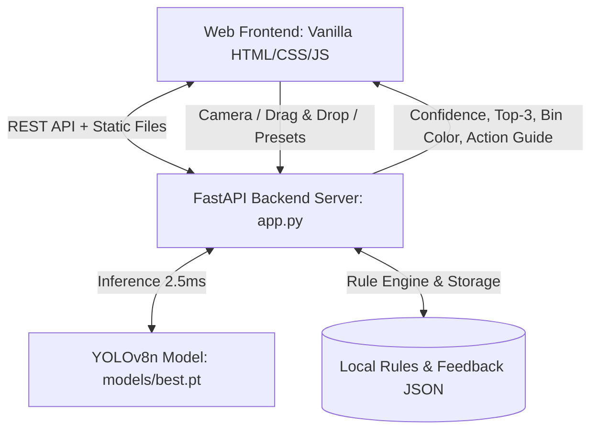

# Kế hoạch Triển khai Web Demo Local Phân loại Rác thải AI (YOLOv8)

Xây dựng ứng dụng Web Demo Local hoàn chỉnh, kết nối trực tiếp với mô hình AI đã huấn luyện [models/best.pt](file:///c:/Projects/Demo%20Waste%20Classification/models/best.pt). Ứng dụng tích hợp đầy đủ 12 Usecases từ [Báo cáo Đề xuất Triển khai AI & Cấu trúc Dự án.md](file:///c:/Projects/Demo%20Waste%20Classification/B%C3%A1o%20c%C3%A1o%20%C4%90%E1%BB%81%20xu%E1%BA%A5t%20Tri%E1%BB%83n%20khai%20AI%20Offline%20&%20C%E1%BA%A5u%20tr%C3%BAc%20D%E1%BB%B1%20%C3%A1n.md) với thiết kế hiện đại (Rich Aesthetics, Glassmorphism, Dark Mode, Micro-animations).

---

## Kiến trúc Tổng thể



1. **Backend:** FastAPI chạy local (`http://127.0.0.1:8000`), load sẵn `models/best.pt` vào RAM lúc khởi động, đảm bảo suy luận siêu tốc (~2.5ms). Cung cấp các API:
   - `POST /api/classify`: Nhận ảnh từ upload, webcam hoặc ảnh mẫu; chạy suy luận YOLOv8, kiểm tra ngưỡng Out-of-Distribution (< 60%), mapping với bảng quy tắc xử lý rác.
   - `GET /api/sample-images`: Cung cấp danh sách ảnh mẫu từ `data/trashnet_split/val` để người thuyết trình bấm test ngay lập tức.
   - `GET/POST /api/rules`: Đọc và cập nhật quy tắc phân loại rác (Admin Rule Engine).
   - `GET/POST /api/feedback`: Lưu trữ phản hồi của người dùng khi AI nhận diện sai.
   - `GET /api/stats`: Thống kê tỷ lệ các loại rác đã quét, điểm xanh tích lũy.

2. **Frontend (Giao diện người dùng cao cấp):**
   - **Giao diện:** Dark mode chuẩn thiết kế sang trọng, hiệu ứng kính mờ (Glassmorphism), bảng màu xanh lá neon & cyan công nghệ sinh thái, font chữ Google Fonts `Inter` & `Outfit`.
   - **Khu vực Quét rác (Vision Scanner):**
     - Hỗ trợ Kéo & thả ảnh (Drag & Drop), tải ảnh từ máy tính.
     - Hỗ trợ Mở Webcam thời gian thực với tính năng chụp và nhận diện tức thì.
     - **Thanh thư viện ảnh mẫu (Sample Carousel):** 6 ảnh mẫu tiêu biểu cho 6 loại rác (`cardboard`, `glass`, `metal`, `paper`, `plastic`, `trash`) để bấm thử nhanh trong 1 giây lúc thuyết trình.
   - **Khu vực Kết quả (Smart Classification Card):**
     - Tên loại rác (Tiếng Việt & Tiếng Anh).
     - Thanh đo độ tin cậy (Confidence Bar) sinh động với hiệu ứng gradient.
     - Huy hiệu màu thùng rác tương ứng (Màu vàng, Xanh lá, Xanh dương, Trắng, Đen) và biểu tượng trực quan.
     - Hướng dẫn hành động chi tiết (rửa sạch, bóp bẹp, tháo nắp...).
     - **Cảnh báo Out-of-Distribution (Usecase 2):** Tự động phát hiện khi Confidence < 60% để cảnh báo "Vật thể không xác định / Vui lòng chụp rõ hơn".
     - Nút **"Báo cáo sai (Feedback)"** để mở modal sửa nhãn (Usecase 4 & 11).
   - **Hệ thống Gamification & Eco-Tracker (Usecases 5, 6, 7):**
     - Thanh cấp bậc "Điểm Xanh" (Ví dụ: Mầm non xanh, Chiến binh bảo vệ môi trường, Đại sứ tái chế).
     - Lịch sử quét rác gần đây.
     - Biểu đồ phân bổ tỷ lệ rác đã phân loại trong phiên làm việc.
   - **Khu vực Quản trị (Admin Hub - Usecases 9, 10, 11, 12):**
     - Tab quản trị riêng biệt cho phép xem và sửa nội dung hướng dẫn phân loại của từng loại rác trực tiếp.
     - Xem danh sách ảnh người dùng đã báo cáo sai để kiểm chứng dữ liệu.

---

## User Review Required

> [!IMPORTANT]
> - Backend sẽ sử dụng **FastAPI** và **Uvicorn** (chạy bên trong môi trường ảo `venv` sẵn có). Ta chỉ cần cài đặt nhẹ 2 gói `fastapi uvicorn python-multipart` (~5MB).
> - Frontend chạy dưới dạng Single-Page Application (HTML/CSS/JS thuần không cần build/compile), được server FastAPI phục vụ trực tiếp tại `http://127.0.0.1:8000`.

---

## Proposed Changes

### Backend

#### [NEW] [app.py](file:///c:/Projects/Demo%20Waste%20Classification/app.py)
- Khởi tạo FastAPI app, load mô hình [models/best.pt](file:///c:/Projects/Demo%20Waste%20Classification/models/best.pt).
- Tích hợp các REST endpoints: `/api/classify`, `/api/sample-images`, `/api/rules`, `/api/feedback`, `/api/stats`.
- Tự động mount thư mục tĩnh `static/` để phục vụ giao diện Web.

#### [NEW] [rules.json](file:///c:/Projects/Demo%20Waste%20Classification/data/rules.json)
- Cơ sở dữ liệu quy tắc tĩnh lưu trữ thông tin phân loại: Màu thùng rác, nhóm rác (Tái chế / Sinh hoạt / Nguy hại), các bước hướng dẫn xử lý và các Eco Fact thú vị.

---

### Frontend

#### [NEW] [static/index.html](file:///c:/Projects/Demo%20Waste%20Classification/static/index.html)
- Cấu trúc giao diện HTML5 chuẩn SEO và trợ năng: Header với logo và thanh Eco-Points, thanh chuyển tab (Quét rác, Thống kê, Quản trị), khu vực Upload / Webcam / Sample Carousel, khu vực kết quả trực quan và Modal Feedback.

#### [NEW] [static/style.css](file:///c:/Projects/Demo%20Waste%20Classification/static/style.css)
- Toàn bộ Design System cao cấp: CSS Custom Properties, Dark Mode bảng màu HSL, hiệu ứng Glassmorphism backdrop-filter, gradient neon, animation chuyển cảnh mượt mà, layout responsive hoàn toàn trên cả màn hình máy tính và điện thoại.

#### [NEW] [static/app.js](file:///c:/Projects/Demo%20Waste%20Classification/static/app.js)
- Xử lý tương tác giao diện:
  - Quản lý Webcam (bật/tắt, chụp ảnh, gửi lên API).
  - Kéo thả file ảnh hoặc tải ảnh lên.
  - Gọi API `/api/classify` và render kết quả realtime.
  - Tích điểm Eco Points và cập nhật huy hiệu Gamification.
  - Quản trị quy tắc (Admin editing) và gửi báo cáo Feedback.

---

## Verification Plan

### Automated / Server Tests
1. Cài đặt các phụ thuộc backend:
   ```powershell
   .\venv\Scripts\python.exe -m pip install fastapi uvicorn python-multipart
   ```
2. Khởi động server FastAPI:
   ```powershell
   .\venv\Scripts\python.exe app.py
   ```
3. Kiểm tra HTTP health check và endpoint `/api/classify` với ảnh mẫu test.

### Manual Verification
1. Mở trình duyệt tại `http://127.0.0.1:8000`.
2. Kiểm tra tính năng kéo thả ảnh và bấm ảnh mẫu từ danh sách.
3. Kiểm tra tính năng mở Webcam và chụp ảnh trực tiếp.
4. Kiểm tra ngưỡng Out-of-Distribution (<60%).
5. Kiểm tra tính năng tích điểm xanh (Eco Points) và biểu đồ thống kê.
6. Thử nghiệm tab Quản trị (Admin) để chỉnh sửa quy tắc rác.
