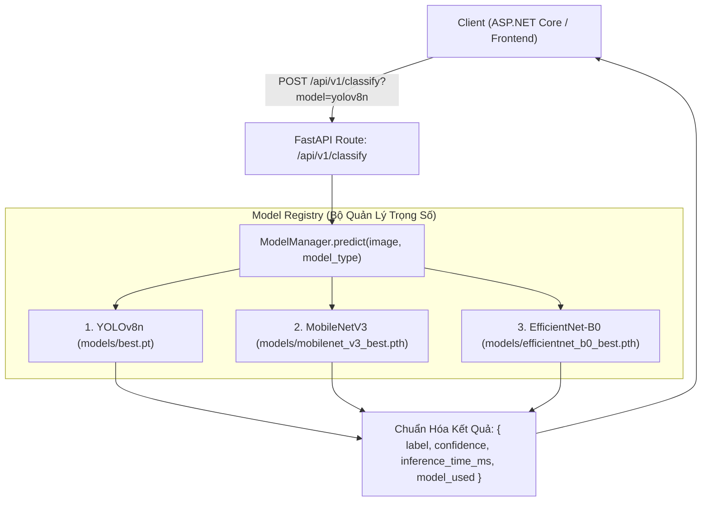

# Kế Hoạch Huấn Luyện & Tích Hợp Đa Mô Hình (MobileNetV3 & EfficientNet-B0)

Kế hoạch này mở rộng hệ thống AI của **EcoLink** từ một mô hình duy nhất (`YOLOv8n-cls`) thành **Hệ sinh thái Đa Mô hình (Multi-Model AI Serving)**, hỗ trợ thêm **MobileNetV3-Small** (tối ưu cho thiết bị di động/edge) và **EfficientNet-B0** (độ chính xác cao với Compound Scaling), phục vụ trực tiếp cho **Usecase 19 (Model Lifecycle & Benchmarking)** trong Khóa luận tốt nghiệp.

---

## Mục Tiêu & Phương Pháp Huấn Luyện Tối Ưu Độ Chính Xác

1. **Bộ dữ liệu:** `data/trashnet_split` (2.019 ảnh train, 508 ảnh val, 6 nhóm rác: `cardboard`, `glass`, `metal`, `paper`, `plastic`, `trash`).
2. **Kỹ thuật tối ưu hóa độ chính xác cao nhất:**
   - **Tăng cường dữ liệu (Data Augmentation):** `RandomResizedCrop(224)`, `RandomHorizontalFlip`, `RandomRotation(15)`, `ColorJitter` (thay đổi độ tương phản, ánh sáng).
   - **Transfer Learning với Trọng số Tiền huấn luyện (ImageNet Pretrained Weights):**
     - MobileNetV3-Small: `models.MobileNet_V3_Small_Weights.DEFAULT`
     - EfficientNet-B0: `models.EfficientNet_B0_Weights.DEFAULT`
   - **Loss Function:** `nn.CrossEntropyLoss(label_smoothing=0.1)` — Label Smoothing triệt tiêu hiện tượng overconfident với ảnh rác bị che khuất hoặc trong suốt.
   - **Bộ tối ưu hóa & Lịch học:** `AdamW` với weight decay $10^{-2}$ kết hợp `CosineAnnealingLR` giúp hội tụ mượt mà và tránh Overfitting.
   - **Số Epochs:** 15 epochs cho mỗi mô hình, tự động checkpoint phiên bản có `val_acc` cao nhất.

---

## Kiến Trúc Tích Hợp Đa Mô Hình (Ecolink.AiService)



---

## Proposed Changes

### 1. Huấn Luyện & Đánh Giá Mô Hình

#### [NEW] [train_torch_models.py](file:///c:/Projects/Demo%20Waste%20Classification/train_torch_models.py)
- Pipeline huấn luyện PyTorch chuẩn khoa học cho **MobileNetV3-Small** và **EfficientNet-B0**.
- Tự động lưu file checkpoint: `models/mobilenet_v3_best.pth` và `models/efficientnet_b0_best.pth`.
- Xuất log chi tiết từng epoch (Train/Val Loss, Accuracy).

#### [NEW] [evaluate_models.py](file:///c:/Projects/Demo%20Waste%20Classification/evaluate_models.py)
- Script đánh giá đối chiếu cả 3 mô hình trên tập `val`:
  - So sánh: Top-1 Accuracy, Top-5 Accuracy, Model Size (MB), Inference Latency (ms/ảnh).
  - Tự động xuất bảng ma trận so sánh (Benchmark Comparison Table) sẵn sàng đưa vào báo cáo KLTN.

---

### 2. Tích Hợp Đa Mô Hình vào `Ecolink.AiService`

#### [NEW] [src/Ecolink.AiService/model_manager.py](file:///c:/Projects/Demo%20Waste%20Classification/src/Ecolink.AiService/model_manager.py)
- Lớp `ModelManager` theo mẫu **Strategy/Factory Pattern**:
  - Hỗ trợ Lazy Loading (chỉ load model vào RAM khi có request gọi tới để tiết kiệm bộ nhớ).
  - Chuẩn hóa đầu vào ảnh và đầu ra xác suất của cả YOLOv8 và PyTorch Torchvision models.

#### [MODIFY] [src/Ecolink.AiService/app.py](file:///c:/Projects/Demo%20Waste%20Classification/src/Ecolink.AiService/app.py)
- Thêm tham số `model_type: Optional[str] = Query("yolov8n", enum=["yolov8n", "mobilenet_v3", "efficientnet_b0"])` vào route `POST /api/v1/classify`.
- Thêm endpoint `GET /api/v1/models` trả về danh sách các model đang sẵn sàng, kích thước và thông số kỹ thuật.
- Trả về trường `model_used` trong kết quả phân loại.

---

## Verification Plan

### Automated / Model Training Tests
1. **Chạy huấn luyện:**
   ```powershell
   .\venv\Scripts\python.exe train_torch_models.py
   ```
   *Kiểm tra:* Cả hai mô hình đạt `val_acc` cao (> 90%), lưu thành công các file `.pth` vào thư mục `models/`.

2. **Chạy đánh giá đối chiếu (Benchmark):**
   ```powershell
   .\venv\Scripts\python.exe evaluate_models.py
   ```
   *Kiểm tra:* Bảng số liệu so sánh 3 mô hình hiển thị đầy đủ các chỉ số Accuracy và Latency.

3. **Kiểm tra API Đa mô hình:**
   - Chạy test API `POST /api/v1/classify?model=yolov8n`
   - Chạy test API `POST /api/v1/classify?model=mobilenet_v3`
   - Chạy test API `POST /api/v1/classify?model=efficientnet_b0`
   - Chạy test API `GET /api/v1/models`
